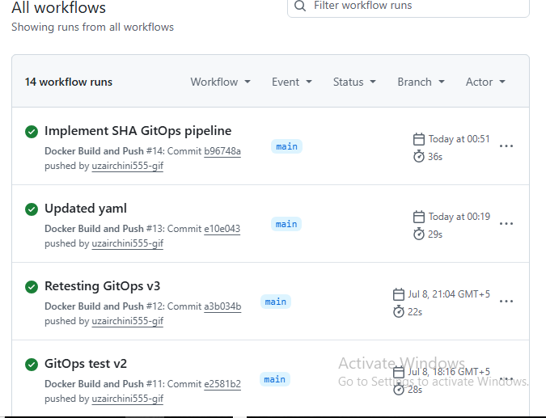
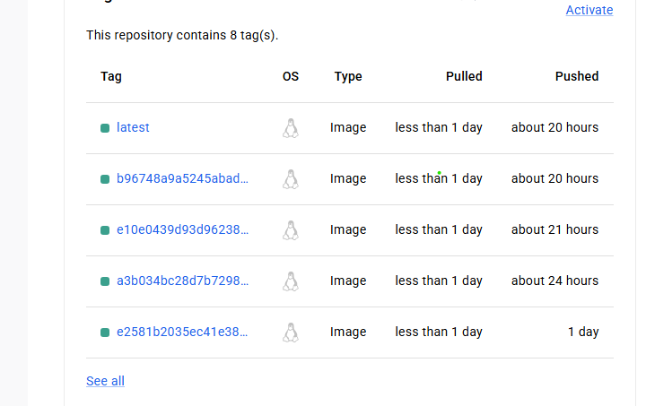
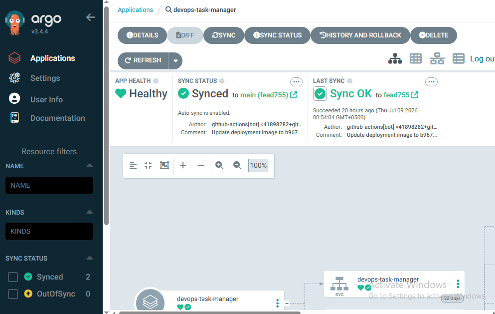
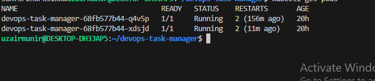
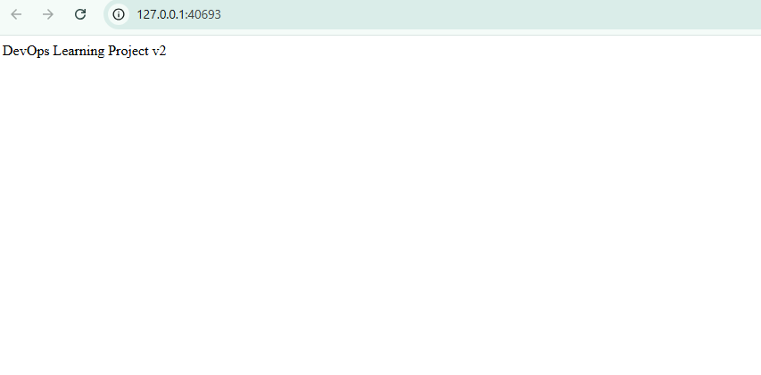

### 🚀 DevOps Task Manager
A production-style DevOps project demonstrating CI/CD, Kubernetes, and GitOps using GitHub Actions, Docker and Argo CD.
This project automatically builds a Docker image, pushes it to Docker Hub, updates the Kubernetes deployment manifest with an immutable GIT SHA image tag, and deploys the latest version to Kubernetes using Argo CD GitOps.

# 📑 Table of Contents

* [Project Overview](#-project-overview)
* [Tech Stack](#-tech-stack)
* [Features](#-features)
* [Architecture](#-architecture)
* [Project Structure](#-project-structure)
* [CI Pipeline](#-ci-pipeline-github-actions)
* [GitOps Workflow](#-gitops-workflow-argo-cd)
* [Kubernetes Resources](#-kubernetes-resources)
* [Important Files](#-important-files)
* [Screenshots](#-screenshots)
* [Getting Started](#-getting-started)
* [Lessons Learned](#-lessons-learned)
* [Future Improvements](#-future-improvements)
* [Author](#-author)

## 🛠 Tech Stack 
Programming Language
- Python

Framework
- Flask

Containerization
- Docker

Container Registry
- Docker Hub

CI
- GitHub Actions

Orchestration
- Kubernetes

GitOps
- Argo CD

## 🎯 Why This Project?

This project was built to gain practical experience with modern DevOps tools and workflows rather than learning them in isolation.

The goal was to understand the complete software delivery lifecycle by building a real CI/CD and GitOps pipeline from scratch. Instead of deploying applications manually, the project demonstrates how modern DevOps practices automate building, versioning, deployment, and synchronization using GitHub Actions, Docker, Kubernetes, and Argo CD.

Throughout the project, real-world issues such as GitHub Push Protection, Docker authentication, Kubernetes deployments, health probes, rolling updates, and GitOps synchronization were encountered and resolved, providing valuable hands-on experience beyond theoretical learning.


## 📖 Project Overview
The DevOps Task Manager is a Flask-based web application built to demonstrate a complete modern DevOps workflow.
The project follows GitOps principles where Git is the single source of truth.Every code change triggers an automated GitHub Actions workflow that: 
1. Build a Docker image 
2. Tags the image with current Git commit SHA 
3. Pushes the image to Docker Hub
4. Updates the Kubernetes deployment manifest with the new image tag
5. Commits the updated manifest back to GitHub
6. Allows Argo CD to detect the Git change and automatically synchronize the Kubernetes cluster.

This workflow demonstrates immutable deployments, automated rolling updates and production-style continuous delivery.

## 🏆 Key Achievements

During the development of this project, the following DevOps concepts were successfully implemented:

* ✅ Dockerized a Python web application
* ✅ Built a complete GitHub Actions CI pipeline
* ✅ Published Docker images to Docker Hub
* ✅ Implemented immutable image versioning using Git SHA
* ✅ Automated Kubernetes Deployment manifest updates
* ✅ Built a GitOps deployment pipeline using Argo CD
* ✅ Implemented Kubernetes Readiness and Liveness Probes
* ✅ Performed automated rolling updates
* ✅ Used Git as the single source of truth for deployments
* ✅ Built an end-to-end CI/CD and GitOps workflow from code commit to production deployment


## ✨ Features

* 🐳 Containerized Flask web application using Docker
* ☸️ Kubernetes Deployment and Service manifests
* ❤️ Readiness and Liveness health probes
* 🔄 Rolling updates with zero downtime
* 🚀 Automated CI pipeline using GitHub Actions
* 📦 Docker image publishing to Docker Hub
* 🔒 Immutable image versioning using Git commit SHA
* 🔁 GitOps continuous deployment using Argo CD
* 📄 Infrastructure stored as Kubernetes YAML manifests
* 📊 Automatic synchronization between Git repository and Kubernetes cluster

## 🏗 Architecture

```text
                Developer
                     │
               git push
                     │
                     ▼
          GitHub Repository
                     │
                     ▼
          GitHub Actions (CI)
                     │
     ┌───────────────┴───────────────┐
     ▼                               ▼
Build Docker Image          Update deployment.yaml
     │                               │
     ▼                               ▼
 Docker Hub                Commit & Push to GitHub
            \                 /
             \               /
              ▼             ▼
                 Argo CD
                     │
              Detect Git Change
                     │
                     ▼
          Kubernetes Cluster
                     │
              Rolling Update
                     │
                     ▼
          DevOps Task Manager
```

## 📂 Project Structure

```text
devops-task-manager/
│
├── .github/
│   └── workflows/
│       └── docker.yaml          # GitHub Actions CI workflow
│
├── k8s/
│   ├── deployment.yaml          # Kubernetes Deployment
│   └── service.yaml             # Kubernetes Service
│
├── app.py                       # Flask application
├── Dockerfile                   # Docker image definition
├── requirements.txt             # Python dependencies
├── .dockerignore
├── .gitignore
└── README.md
```

## 🚀 CI Pipeline (GitHub Actions)
The project uses GitHub Actions to automate the Continuous Integration (CI) process.
CI Workflow 
1. Developer pushes code to the main branch 
2. GitHub Actions checks out the repository
3. Docker image is built using the latest source code.
4. The image is tagged with:
    - The Git commit SHA (immutable tag)
    - latest
5. Both image tags are pushed to Docker Hub 
6. The kubernetes Deployment manifest is automatically updated with the new Git SHA image 
7. The updated manifest is committed and pushed back to the GitHub repository.

## 🔄 GitOps Workflow (Argo CD)

This project follows the **GitOps** model, where **Git is the single source of truth** for Kubernetes deployments.

### Deployment Flow

```text   
Developer
     │
git push
     │
     ▼
GitHub Actions
     │
     ▼
Build Docker Image
     │
     ▼
Push Image to Docker Hub
     │
     ▼
Update deployment.yaml with Git SHA
     │
     ▼
Commit & Push deployment.yaml
     │
     ▼
Argo CD detects Git change
     │
     ▼
Automatic Sync
     │
     ▼
Rolling Update in Kubernetes
     │
     ▼
Updated Application
```

Using immutable Git SHA image tags ensures that every deployment references a specific image version, making deployments predictable, traceable, and easy to roll back.


## ☸️ Kubernetes Resources

The application is deployed to Kubernetes using the following resources:

| Resource        | Purpose                                           |
| --------------- | ------------------------------------------------- |
| Deployment      | Manages application Pods and rolling updates      |
| Service         | Exposes the application inside the cluster        |
| ReplicaSet      | Ensures the desired number of Pods are running    |
| Pods            | Run the Flask application containers              |
| Readiness Probe | Determines when a Pod is ready to receive traffic |
| Liveness Probe  | Detects unhealthy containers and restarts them    |


## 📁 Important Files

| File                            | Description                         |
| ------------------------------- | ----------------------------------- |
| `app.py`                        | Flask Task Manager application      |
| `Dockerfile`                    | Builds the Docker image             |
| `requirements.txt`              | Python dependencies                 |
| `k8s/deployment.yaml`           | Kubernetes Deployment configuration |
| `k8s/service.yaml`              | Kubernetes Service configuration    |
| `.github/workflows/docker.yaml` | GitHub Actions CI workflow          |
| `README.md`                     | Project documentation               |

## 📸 Screenshots

The following screenshots demonstrate the complete DevOps workflow.

| Screenshot        | Description                               |
|-------------------|-------------------------------------------|
|1. GitHub Actions  | |
|2. Docker Hub      |          |
|3. ArgoCD Dashboard||
|4. Kuberenetes Pods||
|5. Running App     |       |


## 🚀 Getting Started

### Prerequisites

Before running the project, make sure you have the following installed:

* Git
* Python 3.x
* Docker
* Kubernetes (Minikube)
* kubectl
* GitHub Account
* Docker Hub Account

### Clone the Repository

```bash
git clone https://github.com/uzairchini555-gif/devops-task-manager.git
cd devops-task-manager
```

### Install Dependencies

```bash
pip install -r requirements.txt
```

### Run the Application Locally

```bash
python app.py
```

### Build Docker Image

```bash
docker build -t devops-task-manager .
```

### Deploy to Kubernetes

```bash
kubectl apply -f k8s/deployment.yaml
kubectl apply -f k8s/service.yaml
```

### Open the Application

```bash
minikube service devops-task-manager
```

## 🧠 Lessons Learned

Building this project provided hands-on experience with modern DevOps practices.

Key takeaways include:

* Designing and building a complete CI pipeline using GitHub Actions.
* Containerizing applications with Docker.
* Deploying applications to Kubernetes.
* Understanding Kubernetes Deployments, Services, ReplicaSets, and Pods.
* Implementing Readiness and Liveness Probes.
* Performing zero-downtime rolling updates.
* Learning why immutable Git SHA image tags are preferred over the `latest` tag.
* Implementing GitOps using Argo CD.
* Understanding that Git—not Docker Hub—is the single source of truth in GitOps.
* Debugging real-world CI/CD, Kubernetes, and GitHub workflow issues.

## ⚡ Challenges Faced

Some of the challenges encountered while building this project included:

* Resolving Docker Hub authentication issues during automated image pushes.
* Fixing GitHub Push Protection after accidentally committing a Personal Access Token.
* Understanding the limitations of the `latest` Docker image tag in GitOps workflows.
* Configuring Kubernetes Readiness and Liveness Probes correctly.
* Learning how Argo CD continuously monitors Git instead of Docker Hub.
* Implementing immutable image deployments using Git commit SHA.
* Debugging Kubernetes rolling updates and Pod lifecycle behavior.

Overcoming these challenges significantly improved my understanding of modern DevOps practices and troubleshooting techniques.

## 📈 Skills Demonstrated

- Git
- GitHub
- GitHub Actions
- Docker
- Docker Hub
- Kubernetes
- Minikube
- Argo CD
- GitOps
- CI/CD
- Rolling Updates
- Readiness Probes
- Liveness Probes
- YAML
- Linux


## 🔮 Future Improvements

Possible enhancements for this project include:

* Deploy to Amazon EKS instead of Minikube.
* Provision infrastructure using Terraform.
* Implement Helm charts for Kubernetes deployments.
* Add Prometheus and Grafana for monitoring.
* Integrate security scanning into the CI pipeline.
* Add automated unit and integration testing.
* Configure HTTPS using Ingress and TLS certificates.
* Deploy using a production-grade Kubernetes cluster.


## 👨‍💻 Author

**Uzair Munir**

Aspiring DevOps Engineer with hands-on experience in Docker, Kubernetes, GitHub Actions, and GitOps using Argo CD.

GitHub: https://github.com/uzairchini555-gif
